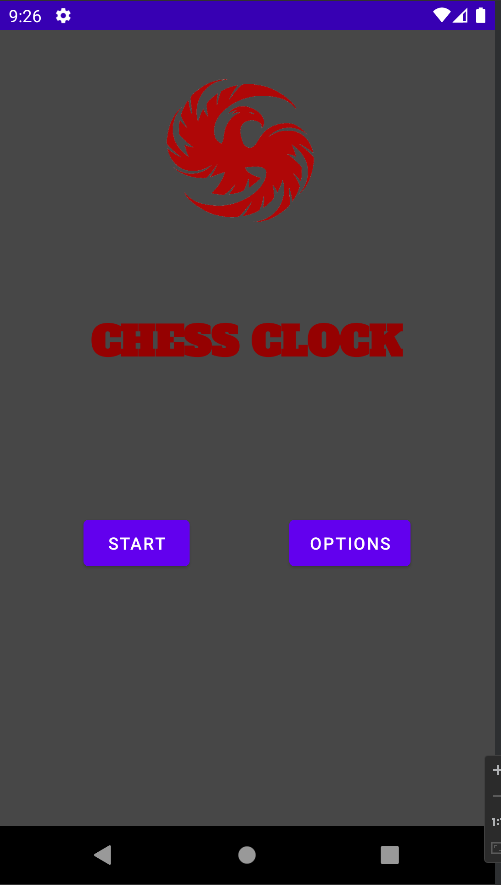
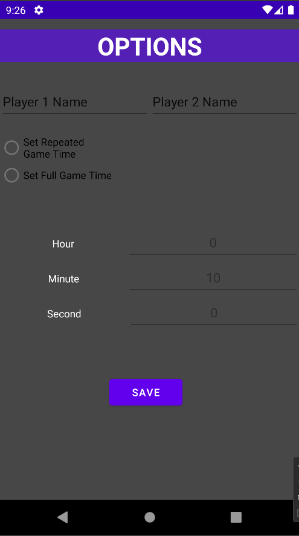
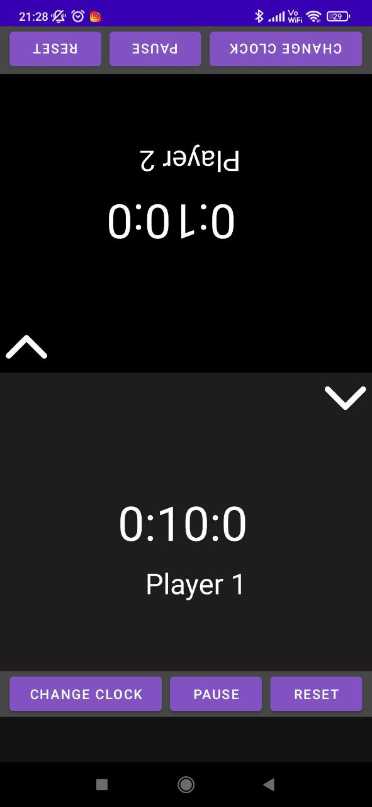

# Chess Clock App

This application is developed by Tolga KALAYCIOĞLU for SENG-405 Lesson. 

Student Number: 201711040

This application simulates a Chess Clock. It was implemented on Android Studio in Java Programming Language. 

It includes options that include game types and time set.

__Download APK__ -> [ChessClock](https://github.com/tolgak99/Assignment02-201711040/blob/master/ChessClock.apk?raw=true)

